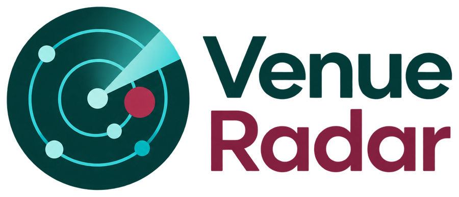
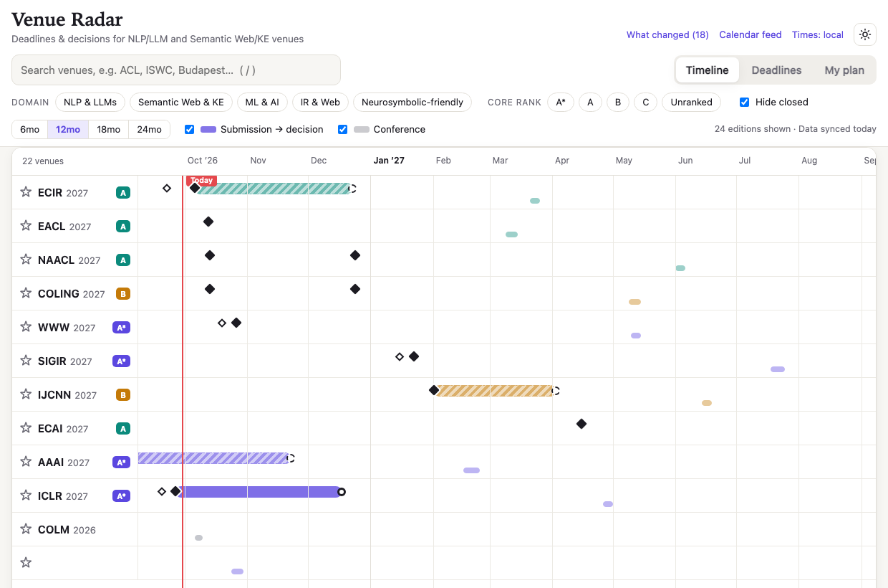
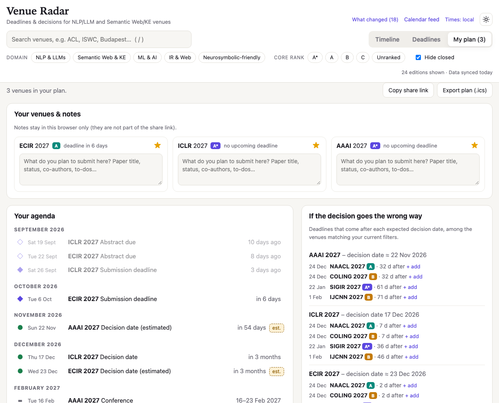

<p align="center">
  <picture>
    <source media="(prefers-color-scheme: dark)" srcset="assets/logo-dark.png">
    
  </picture>
</p>

<p align="center">
  <b>Plan where to publish — not just when the deadlines are.</b><br>
  A free deadline tracker for researchers working between <b>NLP / LLMs</b> and the <b>Semantic Web / Knowledge Engineering</b>.
</p>

<p align="center">
  <a href="https://b-gendron.github.io/venue-radar/"><b>▶ Open the app</b></a>
  &nbsp;·&nbsp; no account, no install, your plan stays in your browser
</p>

<p align="center">
  
</p>

---

## Why this exists

If your work sits between language models and knowledge graphs (neurosymbolic AI, KG-augmented LLMs, ontology learning, knowledge extraction…), you don't have one community, you have **two**, and they don't share a calendar. A good year of publishing might mean ACL/EMNLP *and* ISWC/ESWC/KR, plus the generalist venues (AAAI, IJCAI, ICLR, NeurIPS, WWW…) in between.

Existing deadline trackers show you *when to submit*. What a publication strategy really needs is:

- **The decision date, not only the deadline.** If you get rejected from venue A on 17 December, which good deadlines are still open afterwards? Most trackers can't answer that because they don't record notification dates.
- **Both worlds in one place**, with a filter for each, and a flag for venues that welcome neurosymbolic work.
- **Rolling-review awareness.** ACL-family venues run on ACL Rolling Review (ARR) cycles plus separate "commitment" deadlines. Those show up as distinct cycles instead of one confusing date.
- **Data that stays fresh** without someone hand-editing a spreadsheet.

Venue Radar started as a PhD side-project (a Google Sheet plus a Gantt chart). It is now a small web app that updates itself every week.

## What you can do with it

| | |
|---|---|
| 🗓️ **Timeline** | One row per venue: submission → decision window, deadline markers, conference dates, a "today" line. Zoom from 6 to 24 months. |
| ⏳ **Deadlines** | Everything you can still submit to, soonest first, with countdowns and the (known or estimated) decision date. |
| ⭐ **My plan** | Star the venues you're considering. You get a chronological agenda, warnings when two deadlines collide, and an **"if the decision goes the wrong way"** panel that lists where you could resubmit. |
| 📝 **Notes** | Jot down what you intend to submit to each venue (title, status, co-authors, to-dos). Saved in your browser. |
| 🔎 **Filters** | By domain (NLP & LLMs · Semantic Web & KE · ML & AI · IR & Web), *neurosymbolic-friendly*, CORE rank, and free-text search (press `/`). |
| 📆 **Calendar** | Subscribe to the [calendar feed](https://b-gendron.github.io/venue-radar/calendar.ics) in Google/Apple Calendar, or export just your plan as `.ics`. |
| 📤 **Export & backup** | Take your plan anywhere: **Markdown** (share with your advisor, paste into notes), **CSV** (Excel / Sheets), **`.ics`**, or a **JSON backup** with your notes that you can re-import on another browser or device. |
| 🔗 **Share** | Send a colleague or your advisor a link to your plan. |
| 🔔 **Latest venue info** | A log of deadlines that moved or were announced since the last sync. |

Times are shown in your local timezone (or AoE, one click). Light/dark mode and phone layout included.

<p align="center">
  
</p>

### A 2-minute tour

1. Open the app and pick your **domain** chips (e.g. *NLP & LLMs* + *Semantic Web & KE*).
2. Click **☆** on the venues you're considering. Open **My plan**.
3. Read the agenda, check the crunch warnings, and add a note per venue.
4. Look at **"If the decision goes the wrong way"**. Add a fallback with **+ add**.
5. Export the plan (Markdown, CSV or calendar) to share or keep.

## Venues covered

- **NLP & LLMs:** ACL, EMNLP, NAACL, EACL, COLING, CoNLL, IJCNLP, COLM, NLPCC · *manual:* LREC, TALN
- **ML & general AI:** NeurIPS, ICLR, ICML, AAAI, IJCAI, ECAI, IJCNN, ECML-PKDD
- **Semantic Web, KE & reasoning:** ISWC, KR, RuleML+RR, KSEM, ICCBR · *manual:* ESWC, EKAW, NeSy, EGC, SEMANTiCS, K-CAP
- **IR & the Web:** WWW, SIGIR, CIKM, ECIR, WSDM, SIGKDD

Missing your favourite venue? See [Adding or fixing data](#adding-or-fixing-data).

## How trustworthy are the dates?

Honest answer: **good, not perfect. Always confirm on the official call for papers before you rely on a date.**

- Submission deadlines, places and CORE ranks come from the community-maintained [`ccfddl/ccf-deadlines`](https://github.com/ccfddl/ccf-deadlines) dataset, re-synced **every Tuesday at 14:00 (Paris time)**.
- That dataset has almost **no notification dates**, so this project handles them separately and transparently:
  - **Solid badge:** the date was announced (or entered by hand from the official page).
  - **Dashed "≈" badge:** an *estimate* based on the venue's typical review time. Not confirmed.
  - **"Decision date: unknown":** no reliable information; the app doesn't guess.

## Adding or fixing data

Everything is plain text in `data/`, so a fix is a normal edit or pull request.

**Add a real notification date** (`data/overrides.yml`), and it replaces any estimate:

```yaml
emnlp26:
  notification: 2026-08-20
```

**Track a new venue** (`data/venues.yml`). If it's in the upstream dataset, one line is enough:

```yaml
- { id: emnlp, upstream: AI/emnlp, domains: [nlp] }
```

**Add a venue that upstream doesn't have** (ESWC, EKAW, …) by listing its editions (the dates below are placeholders to show the format, not real ESWC dates):

```yaml
- id: eswc
  acronym: ESWC
  name: Extended Semantic Web Conference
  domains: [kg]
  neurosym: true
  editions:
    - year: 2027
      link: https://2027.eswc-conferences.org
      start: 2027-05-30
      end: 2027-06-03
      tz: AoE
      cycles:
        - { label: Research track, abstract: 2026-12-01, deadline: 2026-12-08, notification: 2027-02-20 }
```

Commit and push, the site redeploys, done. Field documentation is at the top of each file.

## Run or host your own copy

Requires Node ≥ 20.

```bash
git clone https://github.com/B-Gendron/venue-radar.git && cd venue-radar
npm install
npm run sync     # pull the latest upstream data (add --offline to reuse the cache)
npm run serve    # http://localhost:8080
npm test         # unit tests: timezones, date parsing, overrides, change detection, calendar export
```

To publish your own: fork the repo, then **Settings → Pages → Source: GitHub Actions**. The workflow in `.github/workflows/sync-and-deploy.yml` runs weekly (and on every push): tests → sync → commit refreshed data → deploy `site/`.

<details>
<summary><b>How it works / project layout</b></summary>

```
data/venues.yml       which venues to track (+ manual editions)      ← you edit this
data/overrides.yml    hand-curated fixes and notification dates      ← and this
scripts/sync.mjs      merges upstream + your data → site/data/*.json, site/calendar.ics
scripts/lib.mjs       timezone/date parsing, override merging, change detection (unit-tested)
site/                 the app: static HTML/CSS + vanilla JS modules, no build step, no dependencies
assets/               logo and README screenshots
```

- If upstream is unreachable during a sync, the last good data for that venue is kept.
- Your plan and notes live in your browser's `localStorage` (not cookies). There is no server and no tracking. Use **Export → Backup (.json)** and **Import backup** to move them between browsers or devices. Importing never overwrites a note you already have.
- Deep links: `#view=plan&stars=emnlp26,iclr27` (shared plan) · `#edition=ecir27` (open a venue) · `#theme=dark`.

</details>

## Limitations

- Notification dates are the weak spot of every public dataset. Help improve them via `data/overrides.yml`.
- The CORE rank shown is whatever upstream currently carries. Unranked venues appear as "Unranked".
- Estimated decision dates are deliberately not produced for ARR-based venues, since a single review duration would be misleading.

## Credits

Data: [ccfddl/ccf-deadlines](https://github.com/ccfddl/ccf-deadlines) (MIT), plus hand-curated entries. Rankings: [CORE](https://portal.core.edu.au/conf-ranks/) and CCF as carried by that dataset.
